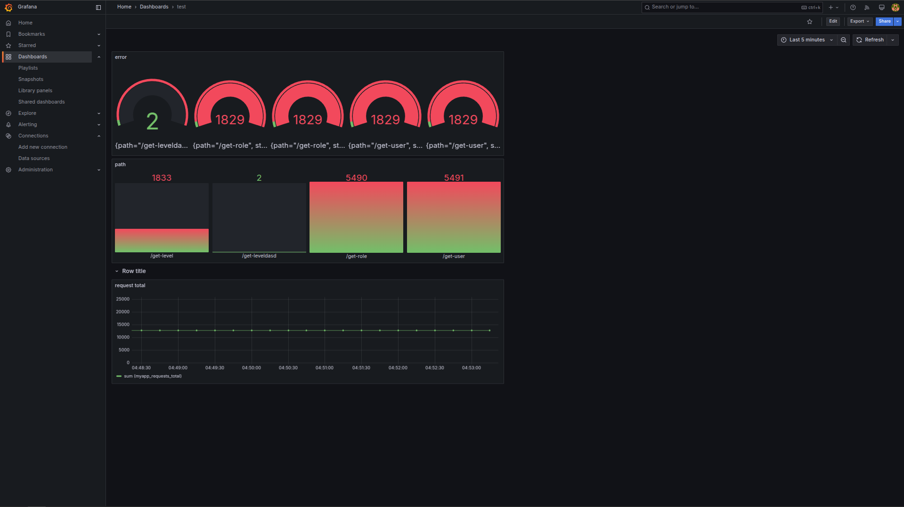

# Project Overview

Project ini adalah aplikasi berbasis Go yang menggunakan Prometheus untuk monitoring dan K6 untuk pengujian performa.

## Struktur Folder

```
.
├── docker-compose.yml  # Konfigurasi Docker Compose
├── Dockerfile          # File Docker untuk membangun image
├── go.mod              # Modul Go
├── go.sum              # Checksum dependensi Go
├── image.png           # Gambar terkait proyek
├── k6                  # Folder untuk pengujian performa
│   ├── api_test.js     # Skrip pengujian dengan K6
│   └── docker-compose.yml  # Konfigurasi Docker Compose untuk K6
├── main.go             # File utama aplikasi
├── Makefile            # Perintah build dan run
├── middleware          # Folder middleware
│   └── prometheus.go   # Middleware Prometheus untuk monitoring
├── prometheus          # Folder konfigurasi Prometheus
│   └── prometheus.yml  # Konfigurasi Prometheus
└── README.md           # Dokumentasi proyek
```

## Prasyarat
- Go (>= 1.18)
- Docker & Docker Compose
- K6 (untuk pengujian performa)
- Prometheus (untuk monitoring)

## Cara Menjalankan

1. **Build & Run dengan Docker**
   ```sh
   docker-compose up --build
   ```

2. **Jalankan secara lokal**
   ```sh
   go run main.go
   ```

3. **Gunakan Makefile** (jika tersedia perintah di dalamnya)
   ```sh
   make run
   ```

## Pengujian dengan K6

Jalankan pengujian performa dengan perintah berikut:
```sh
k6 run k6/api_test.js
```

## Monitoring dengan Prometheus

Prometheus akan berjalan sesuai konfigurasi di `prometheus/prometheus.yml`. Akses UI Prometheus di:
```
http://localhost:9090
```

## Evidence



